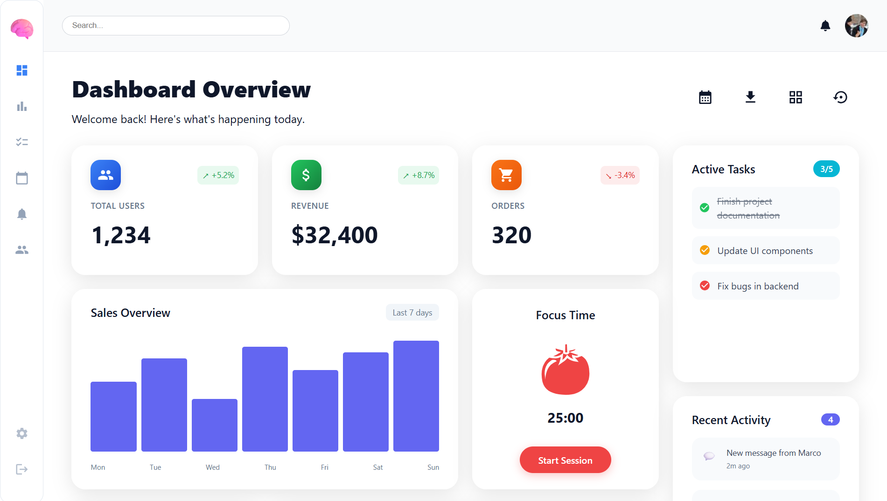
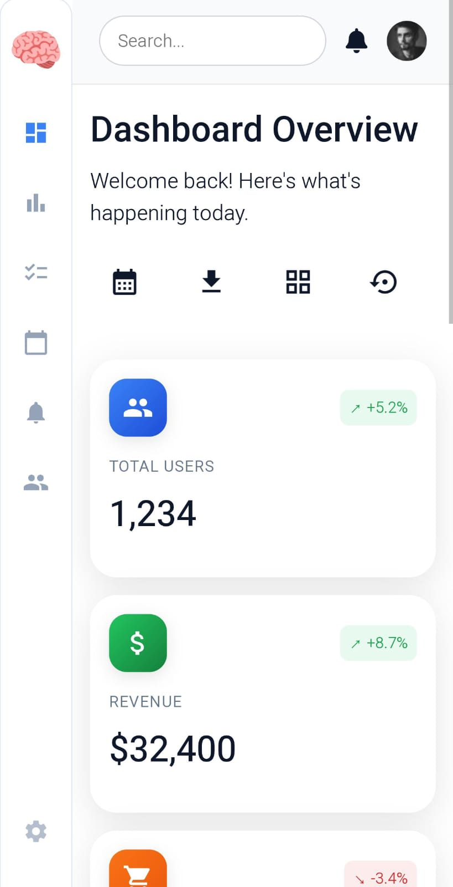

# 🧠 Dashboard per la Produttività Mentale  
Una dashboard moderna in React, ispirata a un design su Dribbble

## 🎯 Panoramica  
Questo progetto è una riproduzione **pixel-perfect** di un’interfaccia per dashboard di produttività, creata come prova tecnica per dimostrare competenze in React e CSS. La dashboard presenta un design moderno in stile **glassmorphism**, con elementi interattivi e layout reattivo.

## ✨ Funzionalità  
- **Design moderno**: Effetti glassmorphism con splendidi gradienti e ombre  
- **Layout reattivo**: Sistema basato su CSS Grid che si adatta a diverse dimensioni di schermo  
- **Architettura a componenti**: Struttura modulare e pulita in React  
- **Elementi interattivi**: Effetti hover e transizioni fluide  
- **Schede della dashboard**: Metriche, grafici, attività, timer Pomodoro e notifiche  

## 🛠️ Tecnologie Utilizzate  
- **React 18** – Libreria UI basata su componenti  
- **CSS3** – Stili moderni con Grid, Flexbox e variabili personalizzate  
- **React Icons** – Iconografia coerente  
- **CSS Grid** – Sistema avanzato di layout  

## Screenshots

### Desktop

### Mobile

## Live Preview

[👉 Prova la demo live qui](https://productivity-dashb.netlify.app/)